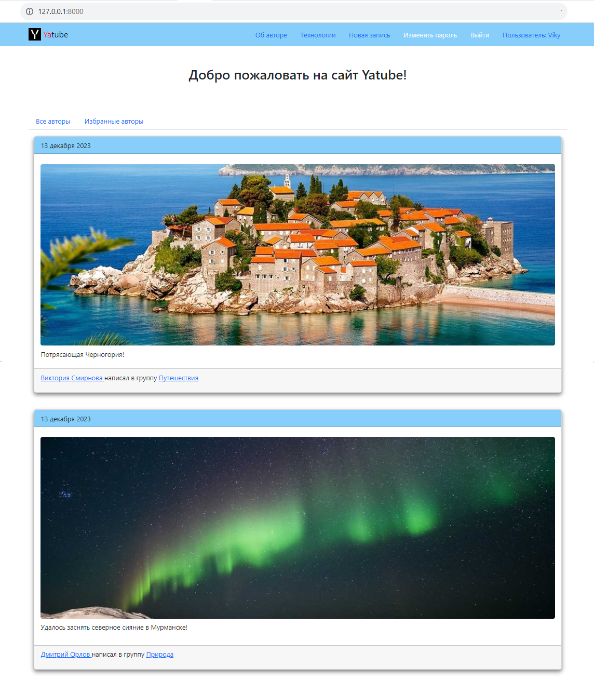
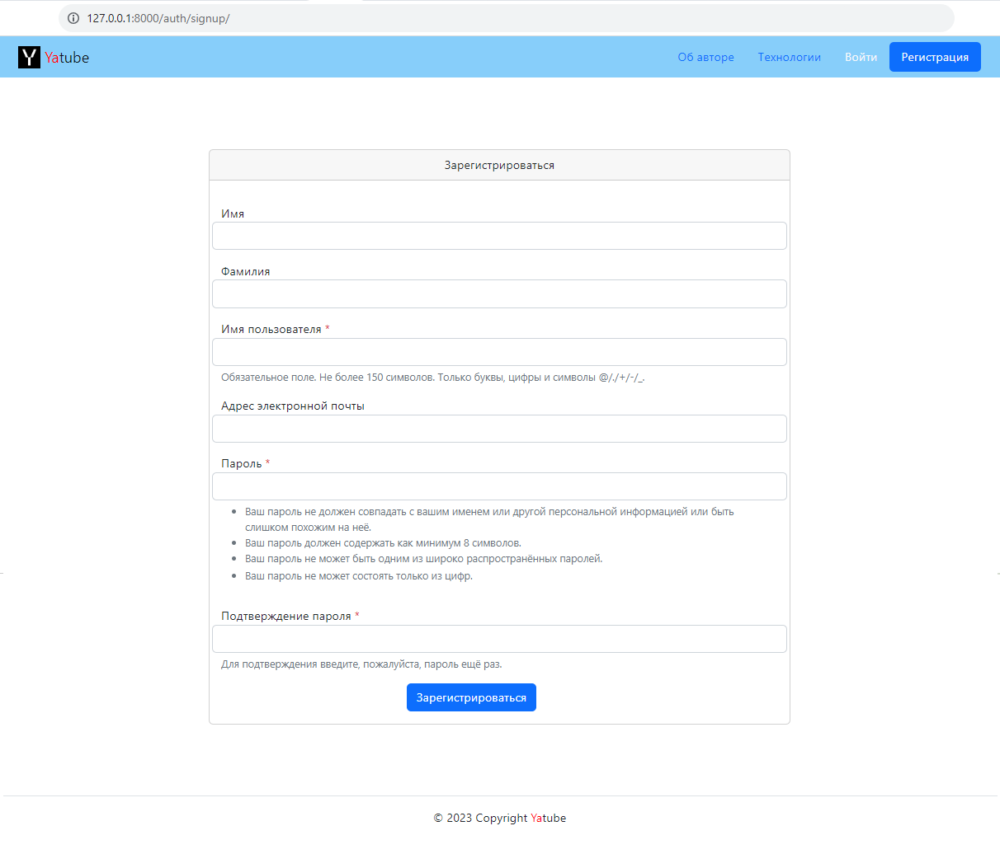
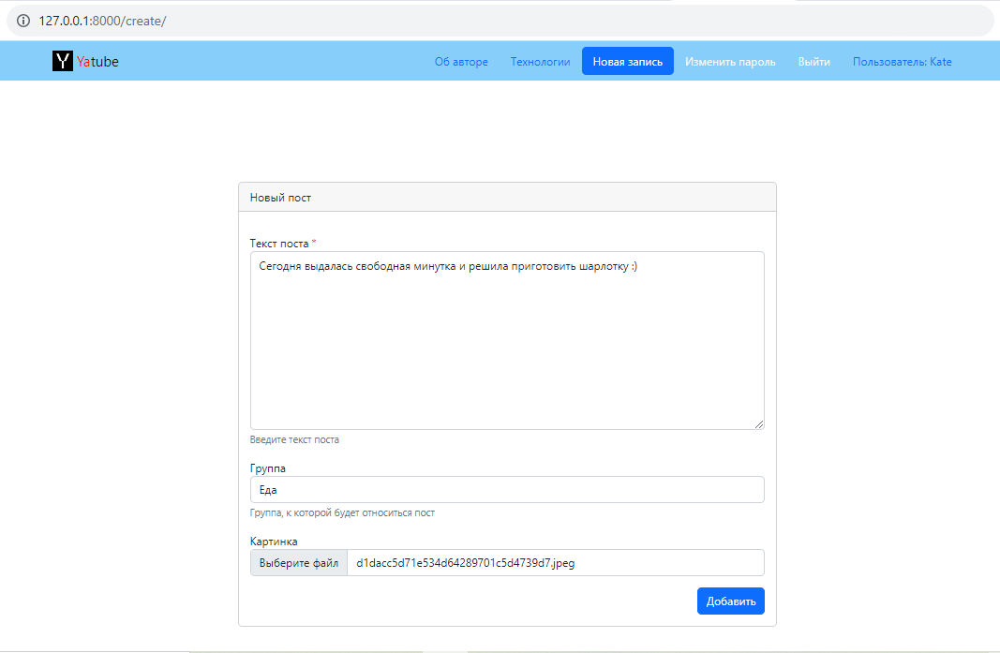
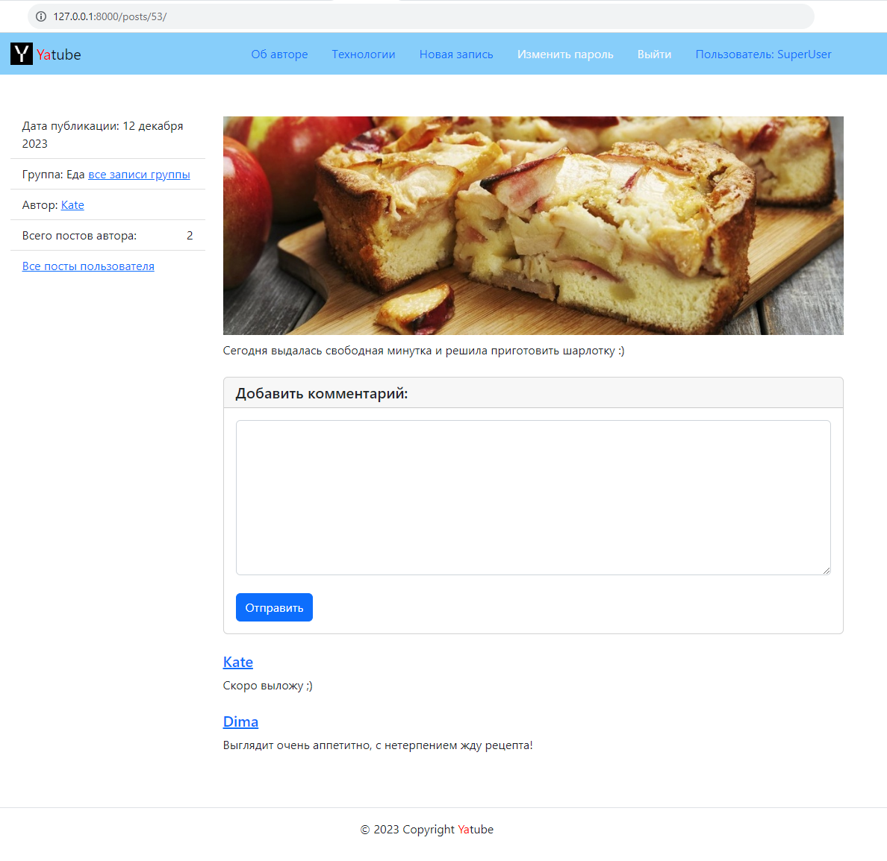
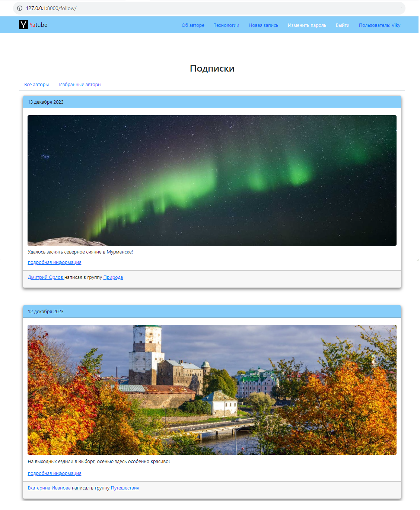

# Yatube
### Описание проекта:

Проект **Yatube** - это социальная сеть, где пользователи могут публиковать 
посты на любые темы (с фотографиями и без), а так же подписываться на других 
пользователей, чтобы не пропустить интересные новости.

### Стек технологий:

- Python 3.9.10
- backend: Django
- frontend: React
- SQLite
- pytest

### Запуск проекта:

<br>1. Клонировать репозиторий:

```
git clone "адрес клонируемого репозитория"
```
<br>2. В корневой директории проекта создать файл .env и написать следующие переменные:

```
# Пременные для СУБД PostgreSQL:
POSTGRES_USER # Имя пользователя
POSTGRES_PASSWORD # Пароль пользователя
POSTGRES_DB # Имя базы даных

# Переменные для Django-проекта:
DB_HOST # Адрес, по которому Django будет соединяться с базой данных(При работе нескольких 
          контейнеров в сети Django network, вместо адреса указывают имя контейнера, где 
          запущен сервер БД)
DB_PORT # Порт, по которому Django будет обращаться к БД. Для PostgreSQL порт по умолчанию 
          5432
```

<br>3. Там же создать и активировать виртуальное окружение:

```
python -m venv env
```

* Если у вас Linux/macOS

    ```
    source env/bin/activate
    ```

* Если у вас windows

    ```
    source env/scripts/activate
    ```

<br>4. Установить и обновить пакетный менеджер:

```
python -m pip install --upgrade pip
```

<br>5. Установить зависимости из файла requirements.txt:

```
pip install -r requirements.txt
```

<br>6. Перейти в папку **yatube** и выполнить миграции:

```
cd yatube
```

```
python manage.py makemigrations
```

```
python manage.py migrate
```

<br>7. Запустить проект:

```
python manage.py runserver
```

### Project's preview:

* **Главная страница**
  
    

* **Страница регистрации**
 
    

* **Страница создания поста**
  
    

* **Страница поста**

    

* **Подписки**

    

### Автор проекта:

Семёнова Юлия (GitHub: JuliSem)